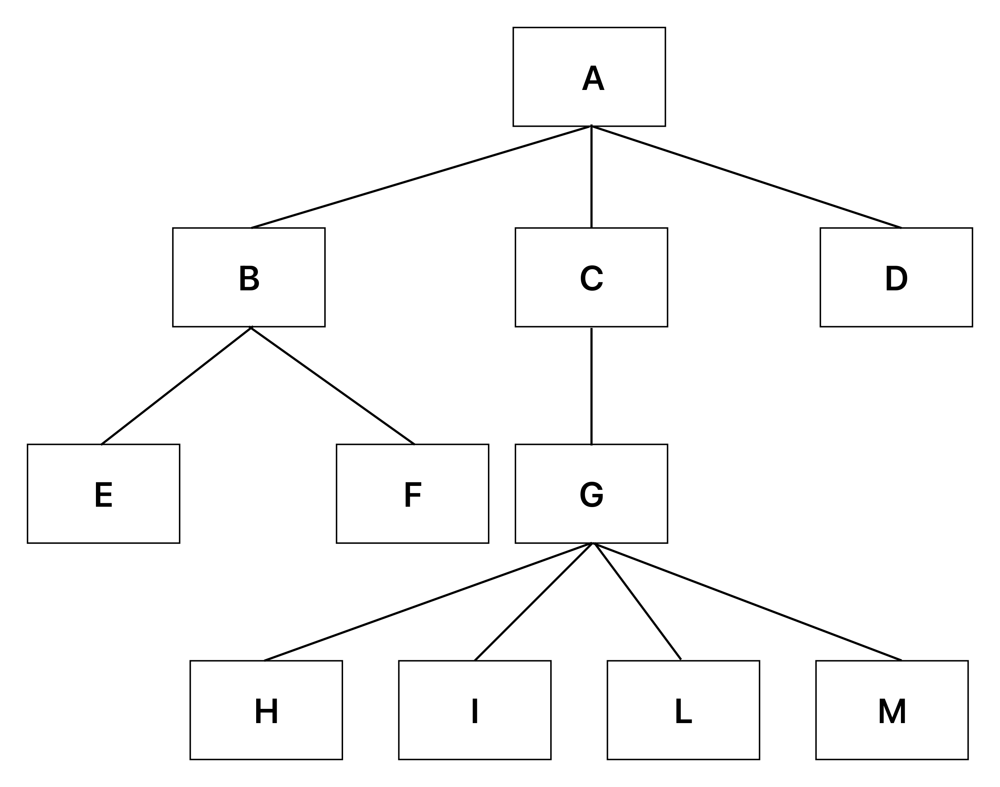
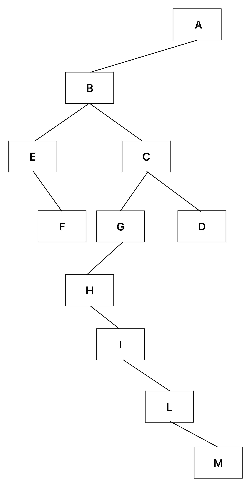

<br />
<div align="center">
  <h1>Algorithms and Data Structures project</h1>
  <p>
    This repository contains the implementation for the laboratory project of Algorithms and Data Structures class at the University of Florence
  </p>
  <p align="center">
    
</p>
</div>

<details>
  <summary>Table of Contents</summary>
  <ol>
    <li>
      <a href="#getting-started">Getting Started</a>
    </li>
    <li>
      <a href="#description">Description</a>
      <ul>
          <li><a href="#list-of-methods">List of methods</a></li>
        </ul>
    </li>
    <li>
      <a href="#running-instructions">Running instructions</a>
    </li>
    <li>
      <a href="#assignment-and-report">Assignment and report</a>
    </li>
    <li>
      <a href="#license">License</a>
    </li>
  </ol>
</details>

# Getting Started

In order to run this [java code](/src/pffs), download Eclipse on the relative [site page](https://eclipseide.org/) or use your favorite IDE.
Project tested in Eclipse 2022-09, installed on Ubuntu Linux 22.04.

# Description

Let create T to be a tree with the following characteristics:

1. each node contains only one piece of information whose type we don't know and
all the information contained in the nodes is of the same type;
2. the maximum number of children each node can have isn't known;
3. inclusion of a node in the tree (excluding the root) is only possible by
specifying the parent of the node that will be inserted and the information that it'll contain.

Such a tree can be stored by keeping for each node a pointer to the first child and a pointer to the next sibling (PFFS).
For example, the tree in [Figure 1](#figure1) becomes the one represented in Figure 2. 
A NodePFFS class and a class are created PFFS tree for managing T. Constructors of the classes will have to be decided based on the needs and choices made for the realization of the project. The variables of instance must be chosen in a manner functional to the above characteristics mentioned and the methods requested below, which require the implementation of the most characteristic operations that can be performed on trees.

<p align="center">
<a href="#figure1">
    
    </a>
</p>
<p align="center">
    Figure 1: A generic tree: A[B[E, F ], C[G[H, I, L, M ]], D]
</p>

<p align="center">
    
</p>
<p align="center">
    Figure 2: Corresponding binary tree 2
</p>

# List of methods

The following list contains methods for each of the following operations:

- Enter the root whose information it will contain is known. The method, that is, receives as input the information of the root.
- Insert a new node V as the child of a node U , already present in the tree.
The method receives as input the parent of the new node, and the information of the latter.
- Insert a new root into a nonempty tree so that the old root is child of the new one.
- Traverse the tree in depth and return the list of information contained in the nodes thus encountered.
- Traverse the tree in breadth and return the list of information contained in the nodes so encountered.
- Return the number of nodes in the tree.
- Given a node, return the number of its children.
- Given a node, return the list of information of its children.
- Return the contents of a node.
- Change the contents of a node.
- Return the root of the tree.
- Return the parent of a node.
- Return the number of leaves of the tree;
- Return the height of the tree.
- Return the level of a node.
- Return a string representative of the T-tree in which the siblings of a node are enclosed in square brackets and separated by commas, recursively. For example, if the entries of the various nodes resulted in the tree depicted in Figure 1, then the representative string is: A[B[E, F ], C[G[H, I, L, M ]], D].

Since the insertion operation requires knowledge of the parent node, it is advisable that the method implemented for such an operation returns the node itself in order to easily retrieve it for later insertion. Note that the tree description doesn't specify the position where a node will be inserted among any parent children already present. It must be possible to view the various parameters of a tree or a node, such as the list of information of a node's children, the information of a node, the list of node information resulting from a certain visit, the height of the tree, etc. For this, it may be useful to implement special methods that facilitate their printing.

# Running instructions

The following code can be executed in various ways:

1. Clone the project directly on VS code or on an IDE of your choice.
2. Download the zipped project and import it on your IDE.

Once the project has been imported into the workspace, run the java class [Run.java](/src/pffs/Run.java).
The result on the screen that will be displayed with the default setting is shown below:

```diff
Return the tree string T: A[B[E,F],C[G[H,I,L,M]],D]
Return the tree root of T: A
Return the tree nodes list visited in depth, DFS:, DFS: [A, B, E, F, C, G, H, I, L, M, D]
Return the tree nodes list visited in breadth, BFS: [A, B, C, D, E, F, G, H, I, L, M]
Return the number of tree nodes of T: 11
Children number of A: 3
Children number of D: 0
Children number of M: 0
Children list of a node A: [B, C, D]
Children list of a node B: [E, F]
Children list of a node G: [H, I, L, M]
Children list of a node H: []
Node father F is: B
Node father L is: G
Number of tree leaves of T are: 1
Tree height of T: 3
Node level E: 2
Node level I: 3
Node level H: 3
Number of children of the T tree are: 7
Change the root of the T tree to: newR
Returns the tree string of T: newR[A[B[E,F],C[G[H,I,L,M]],D]]
Returns the new root of the T tree: newR
Children list of a node newR: [A]
Children list of a node A: [B, C, D]
The number of empty tree (newT) leaves are: 0
```

# Assignment and report

You can have a look at the project [assignment](doc/assignment.pdf), but beware that they have been written in Italian.
While all the source code is commented in English.

# License

Distributed under the GNU General Public License v3.0 . See [LICENSE](LICENSE) for more information.
